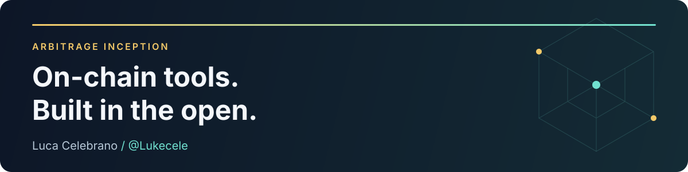

# Arbitrage Inception

**Open-source tools for swaps, on-chain data & DeFi research.**

Founded and built by **[Luca Celebrano · @Lukecele](https://github.com/Lukecele)** — the organization's sole member and maintainer.

**[Follow Lukecele](https://github.com/Lukecele)** &nbsp; · &nbsp; **[Explore the flagship](https://github.com/arbincept/Arb-Inc-All-in-Dex)** &nbsp; · &nbsp; **[Try the app](https://arbitrage-inc.exchange)**

[Projects](#find-your-starting-point) · [Meet the builder](#meet-the-builder) · [Contributions](#contributing-beyond-this-organization) · [Get involved](#help-shape-the-next-build)

---

## Find your starting point

Explore working interfaces, read the source, or build on the parts you need. The projects below cover **BNB Smart Chain**, **EVM networks**, and **Solana** integrations.

### [Arb-Inc All-in-Dex](https://github.com/arbincept/Arb-Inc-All-in-Dex)

**Start here for the main application.** A DEX aggregator with cross-chain bridging and limit orders. Explore wallet-based swap routing through KyberSwap and bridging through Mayan Finance in a mobile-ready interface.

`Next.js` `TypeScript` `EVM / Solana`

[Open app](https://arbitrage-inc.exchange) · [Source & ⭐ star](https://github.com/arbincept/Arb-Inc-All-in-Dex) · [DefiLlama metrics](https://defillama.com/protocol/arbitrage-inc)

### [Inception Flap Scanner](https://github.com/arbincept/inception-flap-scanner)

**Explore token launches on BNB Chain.** Follow bonding curves, holder concentration, and automated contract screening in a live dashboard.

`React` `Node.js` `Docker`

[Open scanner](https://lucace-inception-flap-scanner.hf.space) · [Source & ⭐ star](https://github.com/arbincept/inception-flap-scanner)

### [BSC Arbitrage Scanner](https://github.com/arbincept/bsc-arbitrage-scanner)

**Study how trading costs affect a route.** A read-only Python scanner that models gas, slippage, and token taxes before reporting theoretical opportunities. No wallet or private key required.

`Python` `KyberSwap` `GoPlus`

[Source, setup & ⭐ star](https://github.com/arbincept/bsc-arbitrage-scanner)

### [Arbitrage Inc Earn](https://github.com/arbincept/arbitrage-inc-earn)

**Explore lending and liquid staking interfaces.** A BNB Chain vault explorer connecting Venus, Lista DAO, Stader, and pSTAKE, with token routing through KyberSwap.

`Next.js` `viem` `wagmi`

[Open app](https://arbitrage-inc-earn.vercel.app) · [Source & ⭐ star](https://github.com/arbincept/arbitrage-inc-earn)

### [RWA Stock Arbitrage Suite](https://github.com/arbincept/rwa-stock-arbitrage)

**Research tokenized stock pricing.** Explore market-hours price divergence and spreads between tokenized equity wrappers on BNB Chain. Includes an experimental stdio adapter; the MCP initialization handshake is not yet implemented, and full client compatibility remains unverified.

`React` `TypeScript` `MCP`

[Open dashboard](https://rwa-stock-arbitrage.vercel.app) · [Source & ⭐ star](https://github.com/arbincept/rwa-stock-arbitrage)

## Meet the builder

**[Luca Celebrano (@Lukecele)](https://github.com/Lukecele)** is a medical student and software builder based in Naples, Italy: an MD candidate at **Università degli Studi di Napoli Federico II**, working on an experimental bioinformatics thesis at **TIGEM**.

Arbitrage Inception is his independent open-source organization. His work connects bioinformatics, on-chain systems, and practical developer tools — with more experiments on his personal GitHub:

| Project | What you can explore |
| :--- | :--- |
| **[DEX Swap Tracker & Telegram Bot](https://github.com/Lukecele/Telegram-bsc-buy-sell-bot)** | Liquidity-pool monitoring, Telegram alerts, and a React dashboard. |
| **[Virtue](https://github.com/Lukecele/virtue)** | A rule-based conversational engine and crypto calculator with live market data. |
| **[ARBVPN](https://github.com/Lukecele/ARBVPN)** | A React Native WireGuard client for Android; bring your own server and keys. |
| **[Meme Intelligence On-Chain](https://github.com/Lukecele/meme-intelligence-onchain)** | An experimental Solana research baseline for wallet clustering and liquidity analysis; requires API access and data ingestion. |

**[Follow Lukecele for future builds](https://github.com/Lukecele)** · [Browse his repositories](https://github.com/Lukecele?tab=repositories)

## Contributing beyond this organization

Luca also contributes upstream. Selected **merged pull requests authored by @Lukecele**:

- **Angular** — DevTools signal watch controls gated on host support: [#70986](https://github.com/angular/angular/pull/70986).
- **viem** — Plasma token addresses and Kortana chain support: [#5108](https://github.com/wevm/viem/pull/5108), [#5136](https://github.com/wevm/viem/pull/5136).
- **DefiLlama** — Arbitrage Inc fee adapters and metrics: [#6275](https://github.com/DefiLlama/dimension-adapters/pull/6275), [#6279](https://github.com/DefiLlama/dimension-adapters/pull/6279), [#9453](https://github.com/DefiLlama/dimension-adapters/pull/9453).
- **Ethereum Lists** — Sonic RPC endpoint additions: [#8730](https://github.com/ethereum-lists/chains/pull/8730).

**Discoverability:** All-in-Dex and Inception Flap Scanner are included in Awesome-Web3 through merged submissions [#796](https://github.com/ahmet/awesome-web3/pull/796) and [#795](https://github.com/ahmet/awesome-web3/pull/795).

## Help shape the next build

If something here is useful to you:

- **Follow [@Lukecele](https://github.com/Lukecele)** to stay connected with the builder across projects.
- **Star the repository you find useful** to bookmark it and show which tools you value.
- **Share what you built**, report a reproducible issue, or contribute an improvement. Start with the project's README and the [contribution guide](https://github.com/arbincept/.github/blob/main/CONTRIBUTING.md).
- **Support ongoing work** through [GitHub Sponsors](https://github.com/sponsors/Lukecele).

For collaboration: **[luca.celebrano1@gmail.com](mailto:luca.celebrano1@gmail.com)** · [Telegram community](https://t.me/ArbitrageInception) · [Updates on X](https://x.com/Arbitrageincept)

---

Each project has its own license, setup requirements, and deployment notes. Automated screening and research outputs are informational; check each repository for limitations and security details. Report vulnerabilities through the <a href="https://github.com/arbincept/.github/blob/main/SECURITY.md">security policy</a>.
